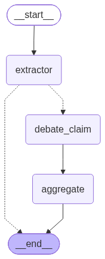
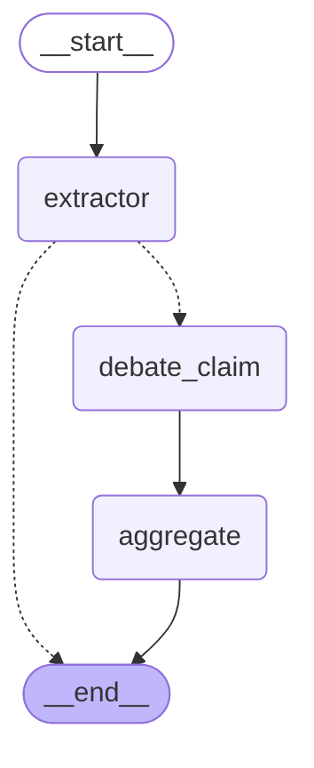
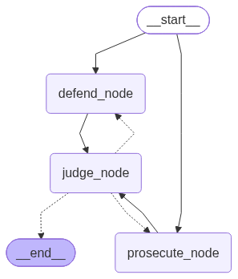
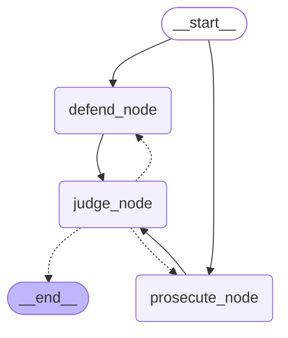

# Ground Truth

Adversarial multi-agent fact auditor — two AI agents argue for and against every claim
in a piece of text, and a judge scores each one with citations and an honest dissent.

**Live demo:** not yet deployed — see [Deployment](#deployment) below. Once deployed,
the Streamlit Community Cloud URL goes here and in the GitHub repo's About section.


<!-- TODO(human): record a ~20s GIF of a real audit run (paste an example, click Run,
     let the status stream and the annotated text render) and save it to
     assets/demo.gif. Placeholder left intentionally — see §9 of the build spec. -->

## The problem

A single-agent fact checker inherits the confirmation bias of whatever search query it
happens to write — ask it to "research this claim" and it tends to find sources that
agree with the claim's framing, not sources that challenge it. Ground Truth instead runs
two agents with opposing mandates against the same claim: a prosecutor searching
specifically for refutation, and a defender searching specifically for confirmation.
Adversarial evidence gathering surfaces contradictions that a single confirmation-seeking
retrieval pass systematically misses, and a judge that has to state the losing side's
strongest point (the `dissent` field) can't quietly rubber-stamp a claim either.

## Architecture

Ground Truth is a [LangGraph](https://github.com/langchain-ai/langgraph) state machine.
The top-level graph extracts claims, then fans out one subgraph invocation per checkable
claim (via `Send`) so claims are audited concurrently:





Each `debate_claim` invocation runs its own compiled subgraph — this is the real
adversarial core, also rendered straight from the compiled graph:





`prosecute_node` and `defend_node` run in parallel and, in round 1, never see each
other's output — that isolation is what keeps the evidence genuinely independent. If the
judge's confidence lands in the ambiguous 40-60 band, `judge_node` routes back to both
nodes for one rebuttal round where each side *does* see the opponent's argument and may
search again. The loop is capped at `MAX_REBUTTAL_ROUNDS = 2` in the routing function
itself ([graph.py](ground_truth/graph.py)), not in a prompt.

Both diagrams are regenerated straight from the compiled graph objects with
`python scripts/generate_diagram.py` — there is no hand-drawn version to go stale.

## How the debate works

Walking one claim through the pipeline, for the input claim *"SpaceX's Falcon 9 rocket
was the first orbital-class rocket capable of reflight, achieving this in 2017."*

**Prosecutor** searches queries like `"Falcon 9 reflight 2017 debunked"` and
`"first reusable orbital rocket criticism"`, reviews what comes back, and — finding
nothing that actually contradicts the claim — returns an honest low-strength argument
rather than inventing an objection:

```json
{
  "stance": "refute",
  "reasoning": "No credible source disputes the 2017 reflight date or SpaceX's claim to the milestone; the closest counterpoint is that some sources describe the Space Shuttle as 'partially reusable' decades earlier, but it was not an orbital-class expendable-to-reusable conversion of the same kind.",
  "strength": 0.15,
  "evidence": []
}
```

**Defender** searches `"Falcon 9 first reflight confirmed"` and `"SpaceX reusable rocket
2017 evidence"`, finds a wire-service report, and builds a confident case:

```json
{
  "stance": "support",
  "reasoning": "Reuters confirms SpaceX successfully relaunched a previously-flown Falcon 9 first stage on March 30, 2017, widely reported as the first reflight of an orbital-class rocket.",
  "strength": 0.9,
  "evidence": [
    {"url": "https://www.reuters.com/...", "title": "SpaceX launches, lands recycled rocket in historic first", "source_domain": "reuters.com", "credibility": 0.8}
  ]
}
```

**Judge** weighs both, notes the prosecution never actually found a contradiction, and
still surfaces its strongest surviving point as the required dissent:

```json
{
  "claim_id": "c1",
  "confidence": 93,
  "label": "supported",
  "reasoning": "A high-credibility wire-service source directly confirms the claim; the prosecution found no credible contradicting evidence.",
  "dissent": "The Space Shuttle program is sometimes cited as an earlier reusable-vehicle milestone, though it differs in kind from a full orbital-class booster reflight.",
  "key_citations": [{"url": "https://www.reuters.com/...", "source_domain": "reuters.com", "credibility": 0.8}]
}
```

*(This is a representative worked example matching the exact schema each agent
produces — this environment has no LLM API key configured, so it wasn't captured from a
live run. `pytest` exercises the real code path with a mocked LLM; `scripts/run_cli.py`
will produce real output once a `GEMINI_API_KEY` or `GROQ_API_KEY` is set.)*

## Quickstart

```bash
git clone https://github.com/aryan122pratap/ground-truth.git
cd ground-truth
pip install -r requirements.txt
cp .env.example .env   # then add GEMINI_API_KEY (free tier) at minimum
streamlit run app.py
```

No `TAVILY_API_KEY` is required — `search.py` falls back to `ddgs` (DuckDuckGo, no key
needed) automatically. Every third-party dependency in the default configuration has a
free tier.

## Design decisions & tradeoffs

- **The rebuttal loop is capped at 2 rounds.** A third round buys very little marginal
  accuracy for roughly 50% more latency and LLM/search cost per ambiguous claim — for a
  demo-oriented tool where "doesn't look frozen" matters as much as precision, that's the
  wrong trade. The cap is enforced in `graph.py`'s routing function, not a prompt
  instruction, so it can't be talked out of it by the model.
- **Credibility is a heuristic, not ground truth.** `search.compute_credibility()` scores
  a source from its domain alone (`.gov`/`.edu`/`.int` and a short list of major wire and
  reference domains score higher, known low-quality patterns score lower, everything else
  is 0.5). It's a cheap prior to help the judge weigh sources, not an authority ranking —
  a `.gov` page can be wrong and a small outlet can break a real story first.
- **Claims are audited in parallel, per-claim.** Each checkable claim gets its own
  `Send`-dispatched subgraph invocation so a 5-claim audit takes roughly as long as the
  slowest single claim, not 5x a single claim's latency — important given the 60-second
  target in the definition of done.
- **Agent outputs reference evidence by index, not by re-emitting full `Evidence` JSON.**
  Prosecutor/defender/judge LLM calls return a small draft schema
  (`used_evidence_indices` / `key_citation_indices`) pointing into evidence already
  fetched by `search.py`, and the real `Evidence` objects are substituted in code. This
  guarantees every citation is a real URL that was actually retrieved — the model can't
  hallucinate a source.
- **Every agent node catches its own exceptions and degrades to a stub result** (`graph.py`)
  instead of raising, so one failed claim or a down search API never crashes the whole
  audit — verified in `tests/test_graph.py` without needing a live LLM.

## Limitations

- The judge and debaters can still hallucinate in their *reasoning* even when the cited
  URLs are real — read the reasoning, don't just trust the confidence number.
- Search results reflect whatever DuckDuckGo/Tavily's index has right now; very recent
  events may be under-covered, and very old claims may surface modern retrospectives
  instead of contemporary sources.
- No paywalled sources are fetched or read in full — agents work from search snippets,
  which can miss nuance in the full article.
- English-only; claim extraction and query generation are not tested against other
  languages.
- The credibility heuristic is domain-based only, per the tradeoff above.

## Roadmap

- Browser extension for auditing text in place on any page.
- PDF ingestion for longer documents (research papers, reports).
- Local Ollama support as a zero-network, zero-key model backend.

## Definition of done

See [GROUND_TRUTH_SPEC.md](GROUND_TRUTH_SPEC.md) §11 for the full checklist this build
was verified against.

## License

MIT — see [LICENSE](LICENSE).
